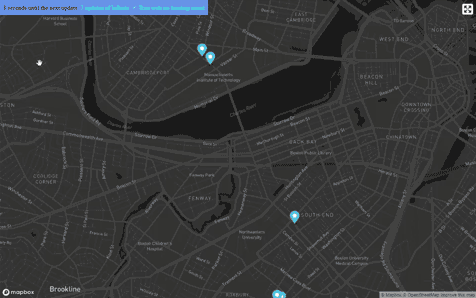

# Real Time Bus Tracker - Boston

**Based on code provided for the MIT xPro Web Development with JavaScript course.**

## Description

The html file features a map generated via the mapbox API. Select Boston Bus line data is fetched live and the tokens on the map are updated with the current bus location and occupancy. 

## How to Run

Clone the Repository or download to your local machine. Enter your [Mapbox API token](https://docs.mapbox.com/help/getting-started/access-tokens/) in the provided place in the index.html file.  Open the index.html file in your browser. 
The file will update four times in 15 second intervals that are shown in a counter. The **Run with no limiting count** checkbox will allow the file to continue to update more than the initial four times and will continue to run until unchecked.
Clicking on any of the markers on the map will show the bus number and current occupancy.

## Roadmap of Future Improvements

* Color tokens to show the occupancy of each bus
* Add new locations/cities from which to pull data
* Expand/add functions to limit which buses are updated based on the coordinates of the current zoom level
* Add a feature to change which map style is used (dark/light, etc.)
* Update the controls so that they still appear in full screen mode

## License info

[MIT License](LICENSE)

